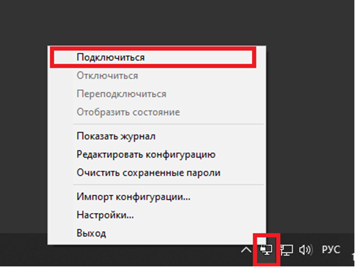
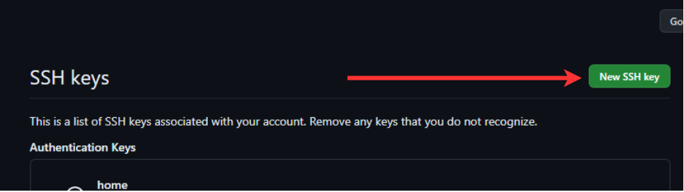

# MIRISCV CORE

MIRISCV - это процессорное ядро, которое поддерживает ISA RV32IM. 

<div align="center">


</div>

## Основные характеристики
- Поддержка стандартов ISA RV32I и RV32M
- Только machine privilege mode
- 4-х стадийный конвейер
- Настроенное окружение под проверку CoreMark
- Написан на SystemVerilog
- Подробная документация


## Содержимое репозитория
|Директория             |Описание                                                             |
|-----------------------|---------------------------------------------------------------------|
|doc                    |Документация на проект                                               |
|├─ miriscv             |Документация на блоки ядра                                           |
|├─ performance_analysis|Инструкции для расчёта удельной производительности процессорного ядра           |
|└─ verification        |Документация на верификационное окружение                            |
|miriscv                |Исходные коды ядра MIRISCV и окружения для CoreMark                      |
|├─ rtl                 |Исходные коды ядра MIRISCV                                                |
|├─ sw                  |Скомпилированный тест CoreMark                                            |
|├─ tb                  |Файл тестбенча                                                       |
|├─ testsoc             |Простая SoC для тестирования ядра и оценки производительности                                   |
|├─ xdc                 |Файл с ограничениями дизайна                                                |
|└─ Makefile            |Makefile для запуска CoreMark                                        |
|miriscv_verification   |Верификационное окружение                                            |
|├─ core_miriscv        | Скрипты и дополнительные файлы для запуска верификации                               |
|└─ ibex                | Дополнительные скрипты и генератор RISCV инструкций|


## Работа с ядром MIRISCV

Информация о взаимодействии с окружением ядра MIRISCV находится в [руководстве пользователя](doc/verification/README.md). Там же описаны способы верификации ядра.

Информацию о блоках ядра MIRISCV можно найти в [документации на ядро MIRISCV](doc/miriscv/miriscv_scheme.md) откуда можно перейти на каждый отдельный блок.

Информацию о запуске CoreMark и подсчёта удельной производительности дизайна можно посмотреть в [performance_analysis](doc/performance_analysis/performance_analysis.md)

Информацию о работе с логами можно найти в [соответствующем руководстве](doc/verification/log_manual.md). Перед прочтением этого руководства предполагается, что вы ознакомились с руководством пользователя.

О суперскалярности MIRISCV можно узнать [здесь](doc/miriscv/dual_issue.md).

## Как подключиться к серверу

<ul>
<details>
<summary>Гайд по подключению к серверу</summary>
<ul>

Если вы находитесь в локальной сети МИЭТ, т.е. сидите со стационарных компьютеров внутри МИЭТа или внутренного WiFi, тогда проигнорируйте следующий спойлер, иначе раскройте его.

<details>
<summary>VPN</summary>

- Подключитесь к МИЭТовской сети через OpenVPN.
<div align="center">


</div>

- Откроется следующее окно, в котором нужно будет ввести логин и пароль от МИЭТовской учётки.

<div align="center">


</div>

- Успешное подключение выглядит так:

<div align="center">


</div>
</details>
</ul>

- Запустите TigerVNC 

Нужно будет ввести данный IP, но со своим значением порта. Номер порта и пароль выдаётся организаторами.

Например: 82.179.178.13:0113

Номер порта – 4 цифры.

<div align="center">


</div>

- После выскочит окно для ввода пароля, пароль будет выдан в первый день хакатона:

<div align="center">


</div>

- Успешное подключение к удалённой машине выглядит так:

<div align="center">


</div>
</details>
</ul>

## Начало работы с репозиторием
При первом подключении на сервер необходимо выполнить все последующие шаги.
Приблизительное время настройки - 5 минут.

В аккаунте GitHub команды, лежит репозиторий, в нем вы можете делать, что угодно. В частности, вы можете создавать и редактировать файлы из интерфейса GitHub, или склонировать репозиторий и работать с ним со своего компьютера.

Чтобы иметь доступ к этому функционалу нужно провести следующий ряд подготовительных работ.

- Сначала сгенерируем ssh ключ. В терминале Linux прописываем команду, чтобы сгенерировать SSH-ключ:
```
ssh-keygen
```
- На все дальнейшие запросы нажимаем Enter, ничего более не вводя. В терминал выдаст текст похожий на рисунок снизу.

<div align="center">


</div>
<details>
<summary>Что такое SSH ключ?</summary>

Мы сгенерировали SSH-ключ. Он нужен, чтобы получить доступ к проектам на GitHub со своего компьютера и выполнять команды без постоянного ввода пароля, нужно, чтобы сервер нас узнавал.

</details>

- Чтобы вывести на экран сгенерированный ключ введём следующую команду:

```
$ cat ~/.ssh/id_rsa.pub
```

Хочется отметить, важно, чтобы был скопирован именно публичный SSH-ключ, он отличается от приватного наличием ".pub" в конце!

После выполнения команды в терминале вы увидите длинную строку:
```
$ ssh-rsa <последовательность символов ключа>
```

- Этот ключ надо добавить в GitHub. Полностью выделяйте и копируйте его. Буфер обмена между удаленным рабочим столом и локальным компьютером должен работать. При возникновении проблем убедитесь, что на локальном компьютере у вас выбрана английская раскладка.

<details>
<summary>Как добавить SSH ключ в GitHub?</summary>
<br>

- Заходим в Settings в GitHub

<div align="center">


</div>

<br>

- Оттуда переход в раздел "SSH and GPG keys"

<div align="center">


</div>

<br>

- Нажимаем на кнопку "New SSH key"

<div align="center">


</div>

<br>

- В поле Title вписывайте то, как вы хотите назвать машину, с которой сидите в данный момент.
- В поле Key вставьте скопированный публичный SSH-ключ 

</details>

- Нужно вписать следующие две команды для git
```
$ git config --global user.name "<имя пользователя>"
$ git config --global user.email <почта пользователя>
```

Например:
```
$ git config --global user.name "John Doe"
$ git config --global user.email johndoe@example.com
```

<details>
<summary>Зачем я прописал что-то в git config?</summary>

Нам нужно указать имя и адрес электронной почты. Это важно, потому что каждый коммит в Git содержит эту информацию, и она включена в коммиты, передаваемые вами, и не может быть далее изменена.
</details>

Все приготовления завершены, мы добились желаемого функционала, а именно вы можете создавать и редактировать файлы из интерфейса GitHub, или склонировать репозиторий и работать с ним со своего устройства.

Осталось пару шагов

- Склонируйте репозиторий

Для этого скопируйте ссылку на репозиторий, как показано на рисунке ниже

<div align="center">


</div>

<br>

И введите в терминал следующие команды:
```
$ cd ~/
$ git clone <скопированная ссылка>
```

- Перейдите в скаченный репозиторий
```
$ cd miriscv_hackathon
```

Готово, вы находитесь в скаченном репозитории, с которым вольны делать, что вам захочется. Успехов!
