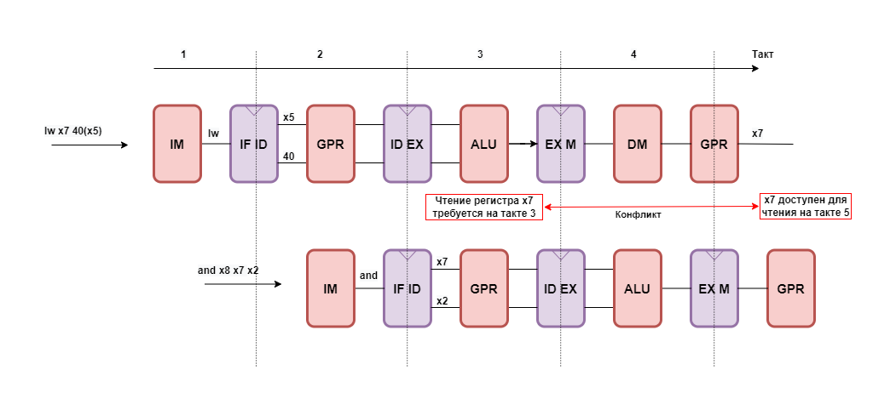
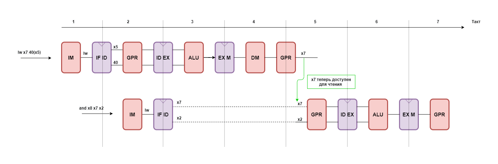

# Control Unit

## Общее описание

Control Unit — устройство, отвечающее за формирование сигналов Stall и
Kill для разрешения конфликтов.

## Параметры

#### Таблица 1. Параметры дизайна

|  Номер  |  Характеристики/Описание  |  Имя параметра  |  Допустимые значения  |  Значение по умолчанию  |
|---------|---------------------------|-----------------|-----------------------|-------------------------|
|  1  | Подключение константы XLEN                       | XLEN       |  32  |  32  |
|  2  | Разрядность шины адреса регистрового файла (GPR) | GPR_ADDR_W |  5   |  5   |

## Интерфейс

#### Таблица 2. Описание сигналов

| Название                                                                | Разрядность | in/out | Описание                                                                                                                     |
|-------------------------------------------------------------------------|-------------|--------|------------------------------------------------------------------------------------------------------------------------------|
| **Тактовый сигнал и сброс**                                             |             |        |                                                                                                                              |
| clk_i                                                                   | 1           | in     | Тактовый сигнал.                                                                                                             |
| arstn_i                                                                 | 1           | in     | Асинхронный сброс. Активный уровень - 0.                                                                                     |
| boot_addr_i                                                             | XLEN        | in     | Адрес, с которого начинается загрузка инструкций после сброса.                                                               |
| **Запросы на формирование сигнала Stall с каждой стадии**               |             |        |                                                                                                                              |
| f_stall_req_i                                                           | 1           | in     | Запрос на формирование сигнала Stall со стадии Fetch                                                                         |
| d_stall_req_i                                                           | 1           | in     | Запрос на формирование сигнала Stall со стадии Decode                                                                        |
| e_stall_req_i                                                           | 1           | in     | Запрос на формирование сигнала Stall со стадии Execute                                                                       |
| m_stall_req_i                                                           | 1           | in     | Запрос на формирование сигнала Stall со стадии Memory                                                                        |
| **Сигналы для формирования сигнала Stall для разрешения конфликта RAW** |             |        |                                                                                                                              |
| f_cu_rs1_addr_i                                                         | GPR_ADDR_W  | in     | Адрес операнда 1                                                                                                             |
| f_cu_rs1_req_i                                                          | 1           | in     | Cигнал для интерфейса RVFI, говорящий о том, что текущая инструкция считывает и использует значение с регистра по адресу rs1 |
| f_cu_rs2_addr_i                                                         | GPR_ADDR_W  | in     | Адрес операнда 2                                                                                                             |
| f_cu_rs2_req_i                                                          | 1           | in     | Cигнал для интерфейса RVFI, говорящий о том, что текущая инструкция считывает и использует значение с регистра по адресу rs2 |
| d_cu_rd_addr_i                                                          | GPR_ADDR_W  | in     | Адрес регистра назначения со стадии Decode                                                                                   |
| d_cu_rd_we_i                                                            | 1           | in     | Сигнал разрешения на запись в регистровый файл со стадии Decode                                                              |
| e_cu_rd_addr_i                                                          | GPR_ADDR_W  | in     | Адрес регистра назначения со стадии Execute                                                                                  |
| e_cu_rd_we_i                                                            | 1           | in     | Сигнал разрешения на запись в регистровый файл со стадии Execute                                                             |
| f_valid_i                                                               | 1           | in     | Сигнал, указывающий на то, что выходные данные с инструкцией действительны со стадии Fetch                                   |
| d_valid_i                                                               | 1           | in     | Сигнал, указывающий на то, что выходные данные с инструкцией действительны со стадии Decode                                  |
| e_valid_i                                                               | 1           | in     | Сигнал, указывающий на то, что выходные данные с инструкцией действительны со стадии Execute                                 |
| m_valid_i                                                               | 1           | in     | Сигнал, указывающий на то, что выходные данные с инструкцией действительны со стадии Memory                                  |
| **Сигналы управления**                                                  |             |        |                                                                                                                              |
| m_branch_i                                                              | 1           | in     | Сигнал для определения следующего значения указателя инструкций при инструкциях условного перехода                           |
| m_jal_i                                                                 | 1           | in     | Сигнал для определения следующего значения указателя инструкций при инструкциях безусловного перехода jal                    |
| m_jalr_i                                                                | 1           | in     | Сигнал для определения следующего значения указателя инструкций при инструкциях безусловного перехода jalr                   |
| m_target_pc_i                                                           | XLEN        | in     | Следующее значение PC в случае перехода (branch/jump)                                                                        |
| m_next_pc_i                                                             | XLEN        | in     | Текущее значение PC + 4 со стадии Memory                                                                                     |
| m_prediction_i                                                          | 1           | in     | Результат предсказания. По умолчанию 0                                                                                       |
| m_br_j\_taken_i                                                         | 1           | in     | Сигнал, указывающий на то, что будет совершен переход                                                                        |
| **Сигнал Stall для каждой стадии**                                      |             |        |                                                                                                                              |
| cu_stall_f\_o                                                           | 1           | out     | Сигнал Stall для стадии Fetch                                                                                                |
| cu_stall_d\_o                                                           | 1           | out     | Сигнал Stall для стадии Decode                                                                                               |
| cu_stall_e\_o                                                           | 1           | out     | Сигнал Stall для стадии Execute                                                                                              |
| cu_stall_m\_o                                                           | 1           | out     | Сигнал Stall для стадии Memory                                                                                               |
| **Сигнал Kill для каждой стадии**                                       |             |        |                                                                                                                              |
| cu_kill_f\_o                                                            | 1           | out     | Сигнал Kill для стадии Fetch                                                                                                 |
| cu_kill_d\_o                                                            | 1           | out     | Сигнал Kill для стадии Decode                                                                                                |
| cu_kill_e\_o                                                            | 1           | out     | Сигнал Kill для стадии Execute                                                                                               |
| cu_kill_m\_o                                                            | 1           | out     | Сигнал Kill для стадии Memory                                                                                                |

## Функциональное описание

### Конфликты

В данном ядре конфликты можно разделить на конфликты по данным и конфликты управления. 

Конфликт по данным происходит, когда команда пытается прочитать из регистра значение, которое еще не было записано предыдущей командой. Пример такой ситуации продемонстрирован на рисунке 1.

#### Рисунок 1. Демонстрация конфликта по данным

Для разрешения такого конфликта происходит сравнение адресов операндов со стадии Decode с адресом регистра назначения на стадии Execute и формируется сигнал Stall. Разрешение конфликта по данным показано на рисунке 2.

Конфликт по управлению разрешается путем анализа предсказания перехода и идентификатора выполнения условия перехода (`m_br_j_taken_i`), сформированных на стадии Exeсute. Если предсказание указывает на то, что перехода не будет, но при этом идентификатор равен 1, то поток инструкций будет перенаправлен в правильном направлении. При этом в момент перенаправления происходит очистка конвейера (формируется сигнал Kill).

