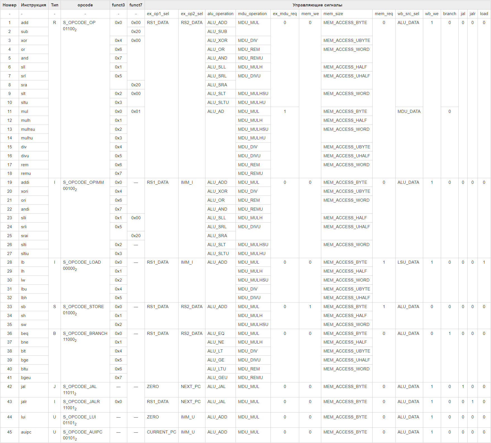

# Документация на блок декодера инструкций

Декодер получает инструкцию из стадии **fetch** и декодирует ее, чтобы сформировать управляющие сигналы, которые определяют, как именно нужно выполнить инструкцию.

Например, для выполнения инструкции загрузки слова из памяти данных в регистровый файл ``lw``, декодер передает запрос на считывание данных (```decode_mem_req_o```) и размер слова (``decode_mem_size_o``). Также декодер решает, будут ли записаны данные в регистровый файл (```decode_wb_we_o```), в какой регистр (```d_gpr_wr_addr_o```) и из какого источника требуется взять эти данные (```d_gpr_src_sel_o```): ALU, MDU или LSU. В рассматриваемом примере данные будут взяты из LSU.

Управляющие сигналы на выходе декодера зависят от трех полей инструкции: ```opcode```, ```funct3``` и ```funct7```. Расположение этих полей одинаково для всех типов инструкций. При этом поля ```funct3``` и ```funct7``` могут отсутствовать для некоторых инструкций.

## Описание интерфейсных сигналов

Ниже приведено описание интерфейсных сигналов блока декодера. Состояния управляющих сигналов для этой инструкции приведены в столбце "Значение по умолчанию".

Сигналы ```decode_fence_o``` и  ```decode_illegal_instr_o``` не используются в данной реализации ядра, поэтому их можно игнорировать.

> Примечание. Все параметры, используемые в декодере находятся в папке ```miriscv/rtl/include``` и импортируются через конструкцию ```import```.

**Таблица 1. Описание интерфейсных сигналов блока**

| Название сигнала       | Разрядность   | Значение по умолчанию | Описание                                                                                                                                   |
| ---------------------- | ------------- | --------------------- | ------------------------------------------------------------------------------------------------------------------------------------------ |
|                        |               |                       | **Управляющие сигналы**                                                                                                                    |
| decode_instr_i         | ILEN          | 0x13                  | Инструкция для декодирования, считанная из памяти инструкций                                                                               |
| decode_ex_op1_sel_o    | OP1_SEL_W     | 0x0                   | Управляющий сигнал мультиплексора для выбора 1-го операнда АЛУ                                                                             |
| decode_ex_op2_sel_o    | OP2_SEL_W     | 0x1                   | Управляющий сигнал мультиплексора для выбора 2-го операнда АЛУ                                                                             |
| decode_alu_operation_o | ALU_OP_W      | 0x0                   | Управляющий сигнал, указывающий, какую операцию нужно выполнить в АЛУ                                                                      |
| decode_mdu_operation_o | MDU_OP_W      | 0x0                   | Управляющий сигнал, указывающий, какую операцию нужно выполнить в MDU                                                                      |
| decode_ex_mdu_req_o    | 1             | 0x0                   | Запрос на выполнение операции умножения/деления                                                                                            |
| decode_mem_we_o        | 1             | 0x0                   | Сигнал, разрешающий запись в память данных                                                                                                 |
| decode_mem_size_o      | MEM_ACCESS_W  | 0x2                   | Управляющий сигнал, указывающий размер слова при чтении/записи в память (знаковый/беззнаковый байт, знаковое/беззнаковое полуслово, слово) |
| decode_mem_req_o       | 1             | 0x0                   | Запрос на доступ к памяти                                                                                                                  |
| decode_wb_src_sel_o    | WB_SRC_W      | 0x0                   | Управляющий сигнал мультиплексора на стадии write back. Определяет что именно будет записано в регистровый файл                            |
| decode_wb_we_o         | 1             | 0x0                   | Сигнал, разрешающий запись в регистровый файл                                                                                              |
| decode_fence_o         | 1             | 0x0                   | -                                                                                                                                          |
| decode_branch_o        | 1             | 0x0                   | Сигнал для определения следующего значения указателя инструкций при инструкциях условного перехода                                         |
| decode_jal_o           | 1             | 0x0                   | Сигнал для определения следующего значения указателя инструкций при инструкциях безусловного перехода jal                                  |
| decode_jalr_o          | 1             | 0x0                   | Сигнал для определения следующего значения указателя инструкций при инструкциях безусловного перехода jalr                                 |
| decode_load_o          | 1             | 0x0                   | Флаг "инструкция LOAD". Используется для выбора константы (imm_i или imm_s) при операциях с памятью                                                                             |
| decode_illegal_instr_o | 1             | 0x0                   | -                                                                                                                                          |                                                                                                                    |
| decode_rs1_re_o        | 1             | 0x0                   | Cигнал, говорящий о том, что текущая инструкция считывает и использует значение с регистра по адресу rs1               |
| decode_rs2_re_o        | 1             | 0x0                   | Cигнал, говорящий о том, что текущая инструкция считывает и использует значение с регистра по адресу rs2               |

## Таблица с инструкциями и управляющими сигналами

Ниже приведена таблица со всеми инструкциями RISC-V RV32IM с соответствующими для них управляющими сигналами. Чтобы уменьшить размер таблицы, убраны префикс "decode_" и постфикс "_o" в названии сигналов

**Таблица 2. Влияние инструкций на управляющие сигналы**


