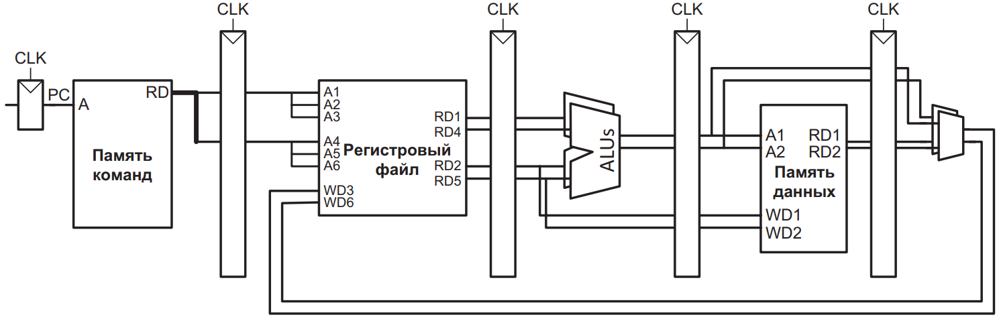
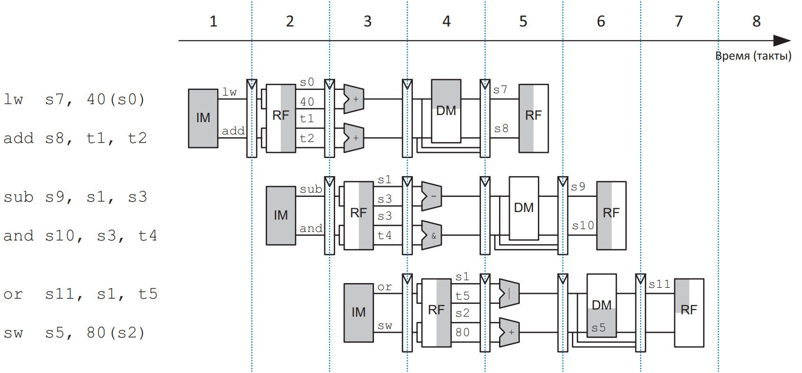

# Dual issue #

### Описание возможности ####
Под dual issue понимается возможность исполнения процессором двух 32-битных инструкций за такт. Исходный процессор miriscv не поддерживает dual issue, для реализации поддержки потребуется учесть нижеизложенное.

Схематичное представление суперскалярного процессора показано на изображении ниже.

*Харис Д., Харис С. Цифровая схемотехника и архитектура компьютера RISC-V. М.: Издательство "ДМК Пресс", 2021. С. 552.*

*Харис Д., Харис С. Цифровая схемотехника и архитектура компьютера RISC-V. М.: Издательство "ДМК Пресс", 2021. С. 552.*

### Интерфейс памяти инструкций ####
Установив параметр DUAL_ISSUE = 1 в miriscv_pkg.sv верификационное окружение и SoC для оценки производительности будут иметь шину памяти инструкций шириной 64 бита. Старшие 32 бита будут содержать команду, следующую по порядку за той, что содержится в младших 32-х битах. Ширина адреса для памяти инструкций от DUAL_ISSUE не зависит, однако от него зависит байтовое смещение (byte offset) и при DUAL_ISSUE = 1 три младших бита адреса не используются. Протокол работы с памятью инструкций не зависит от DUAL_ISSUE.

### Поддержка верификационного интерфейса RVFI ####
Для DUAL_ISSUE = 1 следует удвоить разрядность шин данного интерфейса в соответствии с описанием интерфейса RVFI при NRET = 2 (https://github.com/SymbioticEDA/riscv-formal/blob/master/docs/rvfi.md).