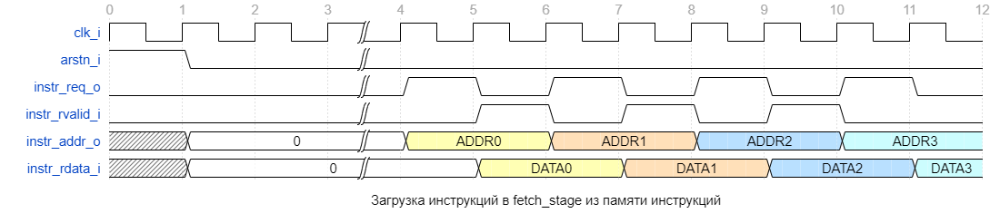

# Документация на блок mirisv_fetch_stage #

## Введение ##
Код в модуле miriscv_fetch_stage реализует стадию Fetch в процессоре RISC-V. Эта стадия получает инструкции из памяти и передает их декодеру для выполнения. Ниже приведены описания портов и параметров блока fetch_stage.


Описание параметров дизайна перечислено и описано в таблице 1.

### Таблица 1. Параметры дизайна ###

|Номер|Описание|Имя параметра|Допустимые значения|Значение по умолчанию|
|:-:|-|:-:|:-:|:-:|
|1|Подключение константы XLEN|XLEN|32|32|
|2|Подключение константы ILEN|XLEN|32|32|
|3|Подключение интерфейса RVFI|RVFI|0/1|0|

## Описание модуля miriscv_fetch_stage ##

Описание сигналов входа/выхода перечислено и описано в таблице 2.

### Таблица 2. Описание сигналов входа/выхода ###

|Номер|Имя сигнала   |Направление сигнала|Разрядность|Значение по умолчанию|Описание|
|:---:|--------------|:-----------------:|:---------:|:-------------------:|:-|
|1    |clk_i         |Вход               |1          |1'b0                 |Тактовый сигнал |
|2    |arstn_i       |Вход               |1          |1'b0                 |Сигнал асинхронного сброса стадии |
|3    |cu_kill_f_i   |Вход               |1          |1'b0                 |Control unit kill fetch. Используется для сброса флага "valid" инструкции, находящейся на стадии. Таким образом, сброшенная инструкция не будет выполнена процессором |
|4    |cu_stall_f_i  |Вход               |1          |1'b0                 |Control unit stall fetch. Активный уровень сигнала приостанавливает работу стадии и выдачу новых инструкций декодеру |
|5    |cu_force_f_i  |Вход               |1          |1'b1                 |Control unit force fetch. Сигнал управления переходом, активный уровень осуществляет принудительную загрузку адреса инструкции |
|6    |cu_force_pc_i |Вход               |XLEN       |32'h80000000         |Control unit force program counter. Адрес инструкции для принудительной загрузки |
|7    |f_stall_req_o |Выход              |1          |1'b0                 |Fetch stall request. Запрос на остановку конвейера от стадии fetch |
|8    |instr_rvalid_i|Вход               |1          |1'b0                 |Instruction read valid. Сигнала подтверждения наличия действительной инструкции |
|9    |instr_rdata_i |Вход               |XLEN       |32'h0                |Instruction read data. Данные пришедшие из памяти инструкций для чтения |
|10   |instr_req_o   |Выход              |1          |1'b0                 |Instruction request. Запрос на новые данные из памяти инструкций |
|11   |instr_addr_o  |Выход              |XLEN       |32'h0                |Instruction read address. Адрес инструкции, к которой выполняется запрос на чтение |
|12   |f_instr_o     |Выход              |ILEN       |32'h00000013         |Fetch instruction. Инструкция идущая на вход Decoder'а для выполнения |
|13   |f_current_pc_o|Выход              |XLEN       |0                    |Fetch current program counter. Текущее состояние регистра PC |
|14   |f_next_pc_o   |Выход              |XLEN       |0                    |Fetch current program counter. Следующее состояние регистра PC, которое загрузится на следующем такте |
|15   |f_valid_o     |Выход              |1          |0                    |Fetch valid. Сигнал указывает, что выходные данные с инструкцией действительны |

### Таблица 3. Подключённые модули ###

|Номер|Описание   													  |Имя модуля		 |
|:---:|---------------------------------------------------------------|:----------------:|
|  1  |компонент, реализующий процесс получения инструкций из памяти  |miriscv_fetch_unit|


## Описание логики работы модуля ##
### Модуль miriscv_fetch_stage ###

Он выполняет следующие функции:

1. Запрашивает данные из памяти;
2. Извлекает инструкцию из полученных данных;
3. Подготавливает данные для передачи в следующую стадию процессора;
4. Обрабатывает сигналы управления, полученные от других модулей.


Теперь разберём функции этого модуля поподробнее.

Модуль miriscv_fetch_stage описывает работу стадии Fetch в процессоре RISC-V.
На этой стадии происходит получение инструкций из памяти и их отправка на следующую стадию конвейера - Decode.


\
Блок работает с памятью инструкций, откуда берёт инструкции для работы всего процессора.
Для работы с памятью имеются входы и выходы модуля, которые связаны с внешней памятью инструкций.
Входы **instr_rvalid_i** и **instr_rdata_i** представляют собой данные, которые процессор получает от внешней памяти инструкций.
Выходы **instr_req_o** и **instr_addr_o** представляют адреса и запросы на чтение, которые отправляются на внешнюю память для получения инструкций.

Выходы **f_instr_o, f_current_pc_o, f_next_pc_o** и **f_valid_o** - это
сигналы, которые передаются на следующую стадию конвейера - Decode.

**f_instr_o** - является выходом с регистра, который хранит текущую инструкцию, полученную с памяти

**f_current_pc_o** - является выходом с регистра, который хранит текущее значение PC

**f_next_pc_o** - является выходом с регистра, который хранит следующее значение PC

**f_valid_o** - является выходом с регистра, который хранит значение действительности данных.
За счёт него, при простое конвейера, данные не заходят в следующую стадию.

\
Модуль получает также сигналы, которые управляют работой конвейера процессора:
**cu_kill_f_i, 
cu_stall_f_i, 
cu_force_f_i, 
cu_force_pc_i, 
f_stall_req_o**.

**cu_kill_f_i, cu_stall_f_i** сигналы отвечающие за управление сигналом **f_valid_o**.
При наличии сигнала **kill**, т.к. необходимо сбросить архитектурное состояние блока, поэтому сигнал **f_valid_o** сбрасывается в 0,
а за счёт **stall** останавливается обновление сигнала **f_valid_o**.

Также к функциям сигнала **stall** в этом модуле можно добавить остановку обновлений загрузки новых значений в выходные сигналы **f_instr_o, f_current_pc_o f_next_pc_o**.

Сигнал **f_stall_req_o** отвечает за запрос в устройство управления на остановку конвейера.

Сигналы **cu_force_f_i** и **cu_force_pc_i** будут описаны ниже.

### RVFI ###

RISC-V Verification Interface в модуле fetch stage не используется, сигналы , нужные для этого интерфейса пробрасываются в следующих стадиях.

### Загрузка инструкций из памяти инструкций ###

<div align="center">



**Про работу памяти можно узнать из документа: [memory.md](memory.md "сслыка на документацию о работе памяти")**
</div>
---
### Модуль miriscv_fetch_unit ###

Данный модуль неразрывно связан с модулем описанным выше, т.к. он дополняет и разворачивает его функции.
Далее будут описан основной функционал блока, подробный разбор сигналов данного модуля остаётся на самостоятельное изучение.

Стоит остановиться на сигналах **cu_force_f_i** и **cu_force_pc_i**. Они выходят из модуля **miriscv_control_unit**, где задаются выражением:
```verilog
  assign cu_force_pc_o = cu_boot_addr_load_en ? boot_addr_i
                                              : m_br_j_taken_i ? m_target_pc_i
                                                               : m_next_pc_i;

  assign cu_force_f_o = cu_boot_addr_load_en | cu_mispredict;
```

Сигнал **cu_force_f_o** фактически говорит, что при наличии сигнала неправильно предсказании перехода
или сигнала принудительной загрузки начального адреса, в регистр PC защёлкнется новое значение.

За это значение отвечает шина **cu_force_pc_o**, которая и выбирает адрес для перехода.

В модуле miriscv_fetch_unit формируется сигнал **instr_req_o**, который является запросом новой инструкции в память.
Тем самым реализуя 1ю функцию стадии.

Активный уровень сигнала **fetch_en**, который проверяет корректность входных данных и остутствие запрета на обновление, позволяет 
обновить регистр **pc_ff**. Последний содержит в себе текущее значение PC.

На сигнал **instr_o** приходят данные из памяти, тем самым блок реализует 2ю функцию стадии.

Сигналы **fetched_pc_addr_o**, **fetched_pc_next_addr_o**, **instr_o**, **fetch_rvalid_o** формируются 
в данном модуле и покрывают 3ю функцию стадии.

Также за счёт сигналов управления происходит обработка входных и выходных данных.
