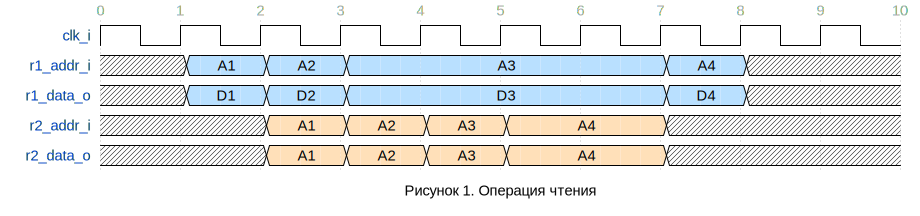
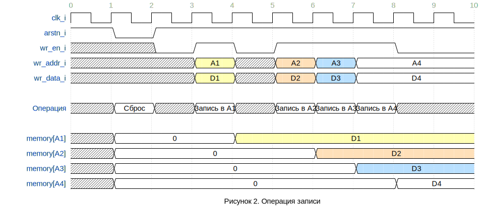

## Регистровый файл

### Общее описание

**Регистровый файл** (**register file, GPR - General Purpose
Registers**) - модуль процессорного ядра, содержащий в себе реализацию
регистров процессора.

### Характеристики блока

-   Регистровый файл имеет 3 порта: 2 независимых порта чтения, 1 порт
    записи
-   Комбинационные порты чтения
-   Поддержка базовых наборов инструкций RV32I и RV32E
-   Настраиваемая разрядность регистров и шин данных

### Описание параметров блока

**Таблица 1. Параметры блока**

| Номер | Название       | Допустимые значения  | Значение по умолчанию | Описание                                  | Комментарий                           |
|-------|----------------|----------------------|-----------------------|-------------------------------------------|---------------------------------------|
| 1     | XLEN           |                      | 32                    | Разрядность шины данных                   | Задается в файле *miriscv_pkg.sv*     |
| 2     | RISCV_E        | 1 - RV32E, 0 - RV32I | 0                     | Включение поддержки базового набора RV32E | Задается в файле *miriscv_gpr_pkg.sv* |
| 3     | GPR_ADDR_WIDTH | 4, 5                 | 5                     | Разрядность шины адреса                   | Задается в файле *miriscv_gpr_pkg.sv* |

### Описание интерфейса блока

**Таблица 2. Сигналы блока**

| Номер             | Название  | Разрядность    | Тип    | Активный уровень | Описание          | Комментарий |
|-------------------|-----------|----------------|--------|------------------|-------------------|-------------|
| 1                 | clk_i     | 1              | input  | \-               | Тактовый сигнал   |             |
| 2                 | arstn_i   | 1              | input  | 0                | Асинхронный сброс |             |
| **Порт записи**   |           |                |        |                  |                   |             |
| 3                 | wr_en_i   | 1              | input  | 1                | Разрешение записи |             |
| 4                 | wr_addr_i | GPR_ADDR_WIDTH | input  | \-               | Шина адреса       |             |
| 5                 | wr_data_i | XLEN           | input  | \-               | Шина данных       |             |
| **Порт чтения 1** |           |                |        |                  |                   |             |
| 6                 | r1_addr_i | GPR_ADDR_WIDTH | input  | \-               | Шина адреса       |             |
| 7                 | r1_data_o | XLEN           | output | \-               | Шина данных       |             |
| **Порт чтения 2** |           |                |        |                  |                   |             |
| 8                 | r2_addr_i | GPR_ADDR_WIDTH | input  | \-               | Шина адреса       |             |
| 9                 | r2_data_o | XLEN           | output | \-               | Шина данных       |             |

### Описание функционала блока

В данном разделе содержится описание функционирования блока и порядок
работы с ним.

Регистровый файл поддерживает две операции: чтения и записи. Ниже
приводится описание и временные диаграммы для каждой из операции.

#### Чтение

Чтение из регистрового файла осуществляется через порты чтения 1 и 2.

Оба порта являются комбинационными - т.е. считываемые данные
выставляются на шину данных в тот же такт, на котором был выставлен
адрес.

Порты чтения 1 и 2 являются независимыми: шины адреса и данных соседних
портов никак не связаны.

По адресу 0 распложен архитектурный аппаратный нуль.

На рисунке 1 приводится временная диаграмма с операциями чтения по обоим
портам.

#### Запись

Запись в регистровый файл осуществляется через порт записи. Для
осуществления записи на одном такте должны быть выставлены сигнал
wr_en_i и валидные значения на шинах адреса и данных. Запись происходит
по переднему фронту при активном сигнале wr_en_i.

Адрес 0 является архитектурным аппаратным *нулем.* Запись по адресу 0 не
меняет внутреннего состояния регистрового файла и может производится для
различных NOP или dummy инструкций, у которых выставляется wr_en_i,

На рисунке 2 приводится временная диаграмма с операциями записи.

