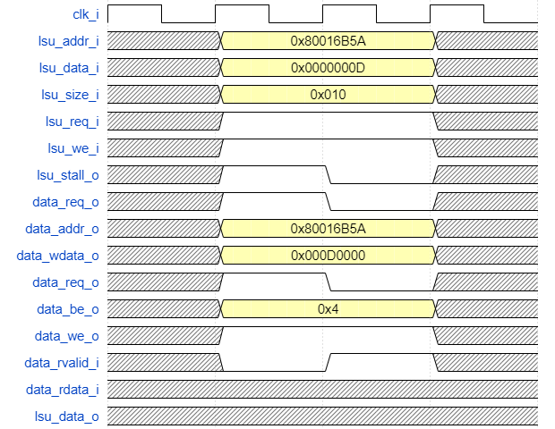

# Load and Store Unit

## Общее описание 

LSU (Load and Store Unit) — устройство, отвечающее за управление
операциями загрузки и хранения данных.

## Параметры

#### Таблица 1. Параметры дизайна

|  Номер  |  Характеристики/Описание  |  Имя параметра  |  Допустимые значения  |  Значение по умолчанию  |
|---------|---------------------------|-----------------|-------------------------|---------------------------|
|  1  | Подключение константы XLEN  |  XLEN  |  32  |  32  |

## Интерфейс

#### Таблица 2. Описание сигналов

| Название                                    | Разрядность | in/out | Описание                                                                                                                       |
|---------------------------------------------|-------------|--------|--------------------------------------------------------------------------------------------------------------------------------|
| **Тактовый сигнал и сброс**                 |             |        |                                                                                                                                |
| clk_i                                       | 1           | in     | Тактовый сигнал.                                                                                                               |
| arstn_i                                     | 1           | in     | Асинхронный сброс. Активный уровень - 0.                                                                                       |
| **Интерфейс, подключаемый к памяти данных** |             |        |                                                                                                                                |
| data_rvalid_i                               | 1           | in     | Сигнал, указывающий на то, что данные на шине чтения валидны.                                                                  |
| data_rdata_i                                | 32          | in     | Шина чтения данных.                                                                                                            |
| data_req_o                                  | 1           | out    | Сигнал, указывающий на то, что идет обращение к памяти.                                                                        |
| data_we_o                                   | 1           | out    | Сигнал разрешения записи.                                                                                                      |
| data_be_o                                   | 4           | out    | Сигнал, указывающий на то, какая часть слова будет записана или считана из памяти (знаковый/безнаковый, байт/полуслово/слово). |
| data_addr_o                                 | 32          | out    | Шина адреса.                                                                                                                   |
| data_wdata_o                                | 32          | out    | Шина записи данных.                                                                                                            |
| **Сигналы, со стадии Execute**              |             |        |                                                                                                                                |
| lsu_req_i                                   | 1           | in     | Сигнал, указывающий на то, что будет инициировано обращение к памяти.                                                          |
| lsu_kill_i                                  | 1           | in     | \-                                                                                                                             |
| lsu_keep_i                                  | 1           | in     | \-                                                                                                                             |
| lsu_we_i                                    | 1           | in     | Сигнал разрешения записи.                                                                                                      |
| lsu_size_i                                  | 3           | in     | Сигнал, указывающий на то, какая часть слова будет записана или считана из памяти (знаковый/безнаковый, байт/полуслово/слово). |
| lsu_addr_i                                  | 32          | in     | Шина адреса.                                                                                                                   |
| lsu_data_i                                  | 32          | in     | Входная шина данных.                                                                                                           |
| lsu_data_o                                  | 32          | out    | Выходная шина данных.                                                                                                          |
| **Сигналы статуса**                         |             |        |                                                                                                                                |
| lsu_stall_o                                 | 1           | out    | Формирует сигнал Stall для приостановки конвейера в момент обращения к памяти.                                                 |

## Функциональное описание

### Load

Для команды Load необходимо выставить на 2 такта адрес **lsu_addr_i**, а
также сигналы **lsu_size_i, lsu_req_i**. С помощью **lsu_size_i** и младших двух
бит адреса **lsu_addr_i** можно задавать ту часть слова, которую необходимо
загрузить. В таблицах 1 и 2 представлен принцип формирования выходного
слова.

#### Таблица 1. Параметры для lsu_size_i

| Значение | Модификатор      | Описание              |
|----------|------------------|-----------------------|
| 0        | MEM_ACCESS_WORD  | Слово                 |
| 1        | MEM_ACCESS_HALF  | Полуслово             |
| 2        | MEM_ACCESS_BYTE  | Байт                  |
| 3        | MEM_ACCESS_UHALF | Беззнаковое полуслово |
| 4        | MEM_ACCESS_UBYTE | Беззнаковый байт      |

#### Таблица 2. Формирование выходного слова

| lsu_size_i       | lsu_addr_i\[1:0\] | lsu_data_o                                           |
|------------------|-------------------|------------------------------------------------------|
| MEM_ACCESS_WORD  | 0                 | data_rdata_i\[31:0\]                                 |
|                  |                   |                                                      |
| MEM_ACCESS_HALF  | 0                 | (XLEN-16){data_rdata_i\[15\]}, data_rdata_i\[15:0\]  |
|                  | 1                 | (XLEN-16){data_rdata_i\[23\]}, data_rdata_i\[23:8\]  |
|                  | 2                 | (XLEN-16){data_rdata_i\[31\]}, data_rdata_i\[31:16\] |
|                  |                   |                                                      |
| MEM_ACCESS_BYTE  | 0                 | (XLEN-8){data_rdata_i\[7\]}, data_rdata_i\[7:0\]     |
|                  | 1                 | (XLEN-8){data_rdata_i\[15\]}, data_rdata_i\[15:8\]   |
|                  | 2                 | (XLEN-8){data_rdata_i\[23\]}, data_rdata_i\[23:16\]  |
|                  | 3                 | (XLEN-8){data_rdata_i\[31\]}, data_rdata_i\[31:24\]  |
|                  |                   |                                                      |
| MEM_ACCESS_UHALF | 0                 | (XLEN-16){1'b0}, data_rdata_i\[15:0\]                |
|                  | 1                 | (XLEN-16){1'b0}, data_rdata_i\[23:8\]                |
|                  | 2                 | (XLEN-16){1'b0}, data_rdata_i\[31:16\]               |
|                  |                   |                                                      |
| MEM_ACCESS_UBYTE | 0                 | (XLEN-8){1'b0}, data_rdata_i\[7:0\]                  |
|                  | 1                 | (XLEN-8){1'b0}, data_rdata_i\[15:8\]                 |
|                  | 2                 | (XLEN-8){1'b0}, data_rdata_i\[23:16\]                |
|                  | 3                 | (XLEN-8){1'b0}, data_rdata_i\[31:24\]                |

Команда Load происходит в соответствии с диаграммой 1.

#### Диаграмма 1. Выполнение команды Load

### Store

Для команды Store необходимо выставить на 2 такта адрес **lsu_addr_i** и
данные **lsu_data_i**, а также сигналы **lsu_size_i**, **lsu_req_i**, **lsu_we_i**,
**lsu_data_be**. Принцип формирования записи представлен в таблица 3-4 .

#### Таблица 3. Формирование сигнала data_be_o

| lsu_size_i          | data_be_o                     |
|---------------------|-------------------------------|
| MEM_ACCESS_WORD     | 'b1111                        |
| MEM_ACCESS\_(U)HALF | 'b0011 \<\< lsu_addr_i\[1:0\] |
| MEM_ACCESS\_(U)BYTE | 'b0001 \<\< lsu_addr_i\[1:0\] |

#### Таблица 4. Формирование выходного слова

| lsu_addr_i\[1:0\] | data_wdata_o                                |
|-------------------|---------------------------------------------|
| 0                 | lsu_data_i\[31:0\]                          |
| 1                 | { lsu_data_i\[23:0\], lsu_data_i\[31:24\] } |
| 2                 | { lsu_data_i\[15:0\], lsu_data_i\[31:16\] } |
| 3                 | { lsu_data_i\[ 7:0\], lsu_data_i\[31: 8\] } |

Команда Store происходит в соответствии с диаграммой 2.

#### Диаграмма 2. Выполнение команды Store

