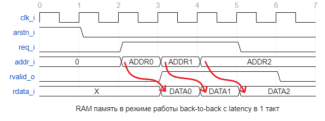

# Работа RAM в miriscv #

Данная модель памяти работает в режиме BTB(back-to-back) с задержкой в 1 такт

Back-to-Back (BTB) - это режим работы памяти, который позволяет ускорить доступ к данным за счет меньшего количества простоев. 

Режим BTB может использоваться для выполнения нескольких операций доступа к памяти в одной сессии. В этом случае, если требуется несколько последовательных операций чтения или записи данных, то они могут быть выполнены в режиме BTB без задержек между ними. Контроллер памяти, в данном случае **miriscv_fetch_unit**, запрашивает данные и сохраняет их во внутреннем буфере, который затем используется для выполнения последующих операций доступа к памяти без задержек.

Доступные в составе ядра Fetch Unit и Load Store Unit первоначально не поддерживают back-to-back режим доступа, но вы можете его добавить, тем самым повысив производительность.

