# Оценка производительности процессора #
  
#### Перед запуском команд, описанных в данном документе, предварительно перейдите в директорию miriscv_hackathon/miriscv #### 

Оценка эффективности микроархитектурных решений происходит в два этапа. Первый - получение значения CoreMark/MHz. Второй - расчёт удельной производительности. Подробнее о каждом этапе речь пойдёт ниже.
## Получение значения CoreMark/MHz В VIVADO ##
CoreMark тест представляет из себя выполнение процессором кода с использованием общих для многих приложений алгоритмов и структур данных. Подробнее с содержанием CoreMark тестов можно ознакомится по ссылке https://github.com/GaloisInc/BESSPIN-coremark . Для проверки синтезируемости вашего дизайна необходимо запустить  CoreMark тест в пост-синтез симуляции (post-synthesis simulation). ***Но так как пост-синтез симуляция длится долго, первые итерации запуска теста следует проводить в поведенческом моделировании.*** Предкомпилированный и дизассемблированный код CoreMark теста находится в папке SW. Этот код загружен в модель памяти процессора. Запуск теста будет происходить в среде разработки VIVADO. За создание проекта в VIVADO отвечает скрипт create_project.tcl. Для автоматизации загрузки данного скрипта в VIVADO используется Makefile. Ввод команды ***make proj_open*** в командной строке создаёт проект и открывает его в графическом окне (рисунок 1).  

``` make proj_open ```
  
  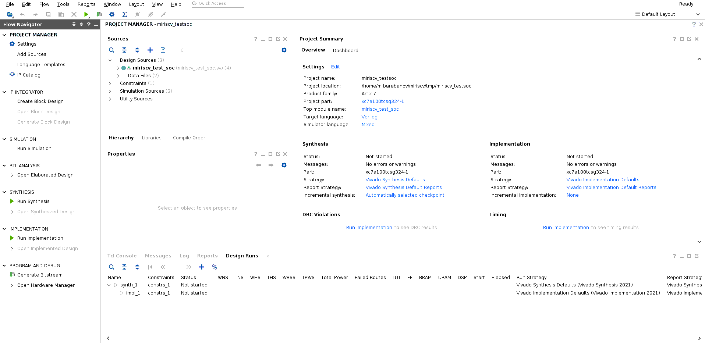
##### Рисунок 1 Проект в gui VIVADO #####


    
miriscv_test_soc.sv является top модулем. Для просмотра иерархии модулей проекта нажмите на miriscv_test_soc под иконкой Design Sources. После этого раскроется иерархия модулей ( Рисунок 2 ) 
  

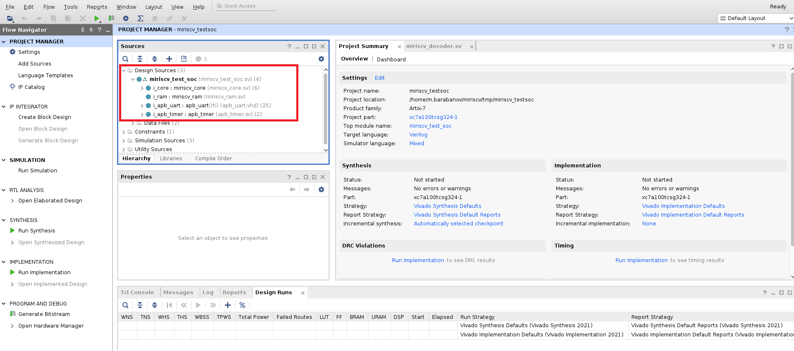
##### Рисунок 2 Раскрытая иерархия модулей в gui VIVADO #####
  

Для запуска поведенческого моделирования нажмите на Run Simulation → Run Behavioral Simulation (Рисунок 3)
    
  
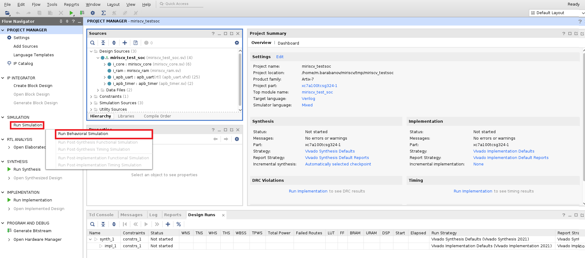
##### Рисунок 3 Запуск поведенческого моделирования #####
  

После запуска поведенческого моделирования появится окно с временной диаграммой. Нажмите на Run All, чтобы получить результаты теста ( Рисунок 4 ).
  
  
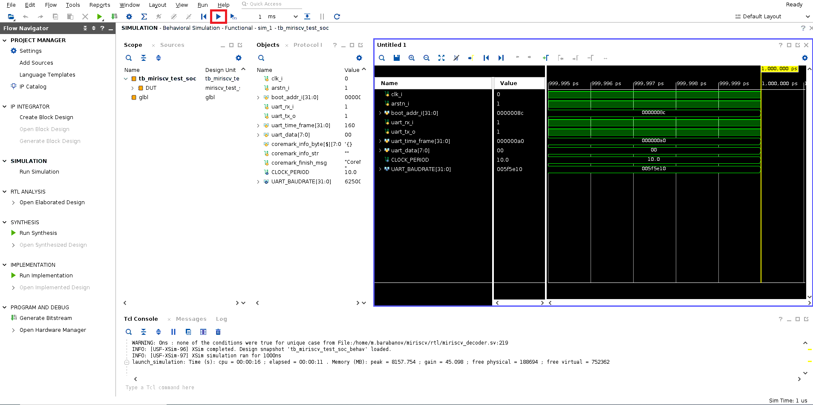
##### Рисунок 4  Запуск моделирования через Run All #####
    
  
После симуляции растяните окно TCL console для просмотра результатов CoreMark теста ( Рисунок 5 )
      
  
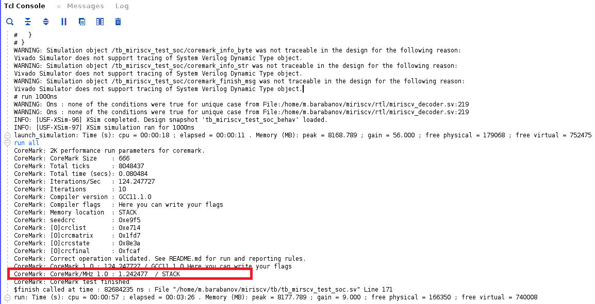
##### Рисунок 5  Результаты CoreMark теста #####
    
  
Нас интересует строка результатов(лога) с значением CoreMark/MHz. В данном примере получено значение 1.242477
Как говорилось выше конечная цель это запуск CoreMark тестов в пост-синтез симуляции (post-synthesis simulation). Для этого предварительно нужно провести синтез проекта, нажав на run Synthesis и подтвердив действие в всплывающем окне нажатием ОК ( Рисунок 6 )
      
  
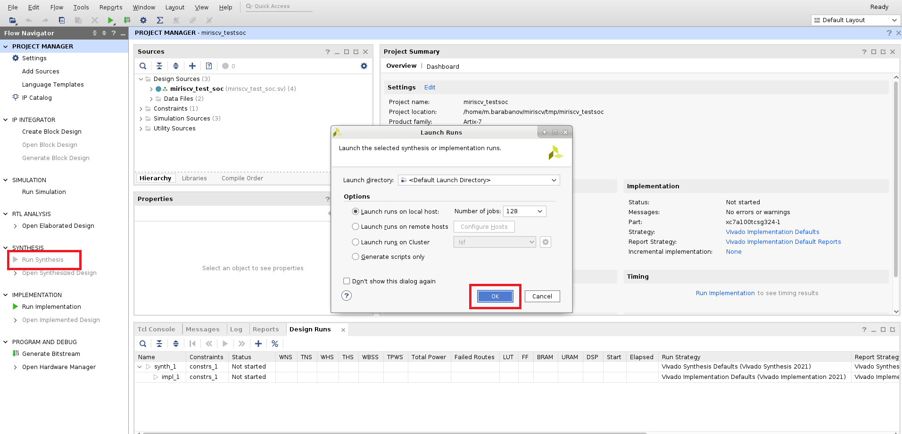
##### Рисунок 6  Запуск синтеза проекта #####


После завершения синтеза мы можем запустить пост-синтез симуляцию.  Для этого нажмите на Run Simulation и в всплывающем окне нажмите на Run Post-Synthesis Functional Simulation ( Рисунок 7 ) . ***Помните, что пост-синтез симуляция длится долго и первые итерации запуска CoreMark теста проводятся в поведенческом моделировании.***


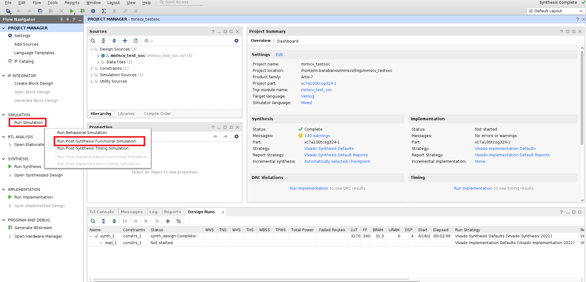
##### Рисунок 7  Запуск пост-синтез симуляции #####


Дальнейшие действия аналогичны действиям при поведенческом моделировании. То есть нам нужно получить результаты CoreMark теста в окне Tcl Console ( Рисунок 4-5 ). Помните, что пост-синтез моделирование будет идти гораздо дольше поведенческого.
  
    
## Расчёт удельной производительности  ##


Для расчёта удельной производительности нужно получить значения Slack для худшего критического пути. Slack расчитывается после STA (статического временного анализа). STA проводится после имплементации проекта. Ниже даётся краткое описание расчёта Slack. 
  
Для корректной работы последовательностных устройств предъявляются ряд требований. Информационный вход схемы должен оставаться стабильным в течение времени предустановки (tsetup) до прихода активного уровня фронта тактового сигнала и не должен изменяться в течение времени удержания (thold) после прихода активного уровня фронта тактового сигнала. (Рисунок 8)    


 
##### Рисунок 8  Времена предустановки и удержания (tsetup и thold) #####

Последовательностные устройства можно условно представить в виде регистров, которые разделены между собой комбинационной логикой. ( Рисунок 9 )

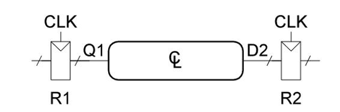
##### Рисунок 9  Условное изображение последовательностных устройств #####


По фронту CLK данные защёлкиваются и попадают на выход Q1 . Далее они распространяются через блок комбинационной логики, и попадают на вход D2. Как показано на рисунке 10 сигнал на входе D2 принимает окончательное значение спустя максимальное время задержки распространения .Серые стрелки указывают минимальную задержку с учетом регистра R1 и комбинационной логики, синие - максимальную. Время tpd - это задержка на комбинационной логике

 
##### Рисунок 10  Временная диаграмма распространения данных между двумя триггерами #####
  

В итоге мы получаем два ограничения. Во-первых данные с выхода Q1  должны распространятся достаточно быстро, чтобы успеть дойти до входа D2 раньше фронта CLK. (tsetup). Во-вторых следующие данные с выхода Q1 должны распространятся достаточно медленно, чтобы по фронту CLK захватились предыдущие данные (thold). 
  
STA проводит анализ tsetup и thold, опираясь на частоту(период), заданную в файле ограничений (constraints) проекта. В данном проекте файл ограничений miriscv_test_soc.xdc лежит в папке xdc и в нём задан период в 1 нс. Результом STA является значение Slack, **которое является разностью между периодом из файла ограничений ( то есть 1 нс ) и  значением периода на котором проект работает без нарушений временных ограничений ( setup time и hold time)**. Так как период, заданный в ограничениях заведомо выбран малым, значения Slack будут получаться отрицательными.
  
Для получения Slack нужно запустить имплементацию проекта ( Рисунок 11 ). Имплементация проводится после синтеза, то есть после неё могут анализироваться задержки на логических элементах и трассировочных ресурсах


##### Рисунок 11  Запуск имплементации #####
  

После имплементации получим значение Slack для худшего критического пути. ( Рисунок 12 ) В данном примере он равен -9,607.

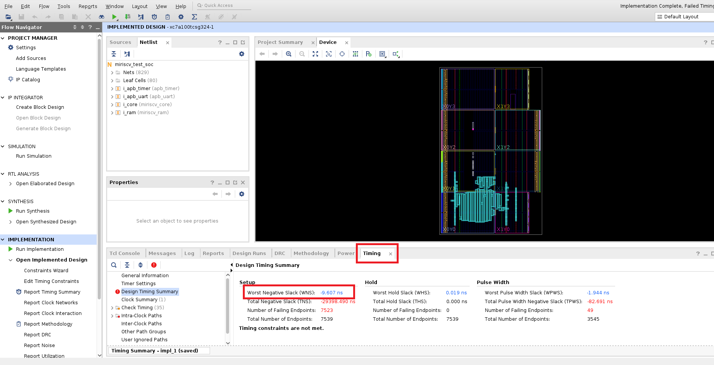
##### Рисунок 12  Значение Slack для худшего критического пути #####
  

Данная информация поможет обнаружить слабые места дизайна. Набор действий сводится к внесению изменений в проект и анализу изменения Slack. Кликнув по значению Slack для худшего критического пути появится информация о Slack для всех критических путей. ( Рисунок 13 )

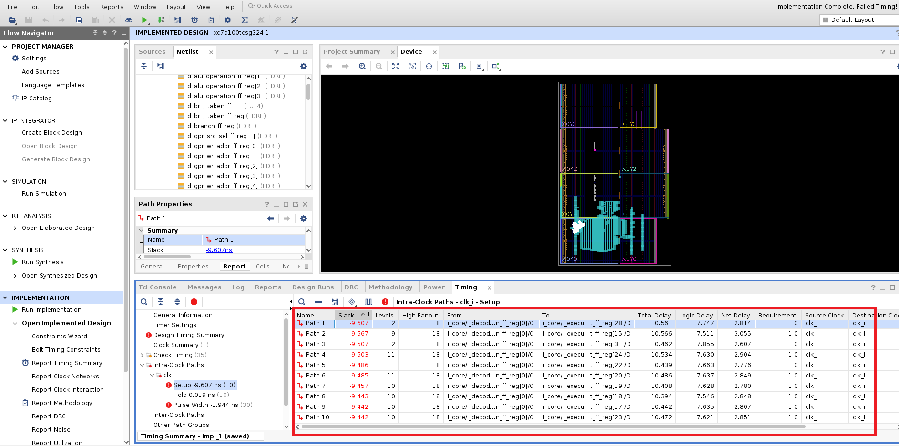
##### Рисунок 13  Значение Slack для всех критических путей  #####

Удобной опцией является просмотр критического пути на уровне структурной схемы. Для этого находясь в окне просмотра значений Slack для всех критических путей ( Рисунок 13 ), кликните на интересующий Вас критический путь и нажмите на клавишу  F4 . В данном примере мы кликнули на критический путь Path1  ( Рисунок 14 ). 


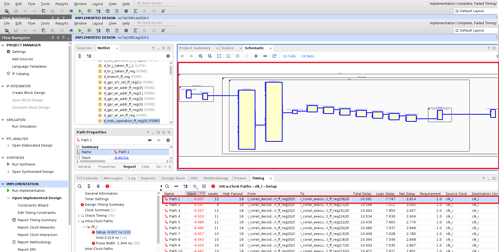
##### Рисунок 14  Просмотр критического пути на уровне структурной схемы  #####

**Итоговые действия для конечного варианта дизайна:**
1. Рассчёт частоты , на которой проект заработает без нарушений временных ограничений. Для этого нужно из 1 нс (значение из файла ограничений miriscv_test_soc.xdc ) вычесть Slack для худшего критического пути (-9,607нс) и найти обратную величину получившегося значения:
    
  &nbsp;&nbsp;&nbsp;&nbsp;&nbsp;``` 1/(1нс - (-9,607нс)) = 94,277 МГц ```

2. Рассчёт удельной производительности. Для этого нужно  частоту, полученную в предыдущем действии умножить на значение CoreMark/MHz, полученное после пост синтез симуляции:
  
  &nbsp;&nbsp;&nbsp;&nbsp;&nbsp;``` 94,277 * 1,242477 = 117,137 ```
