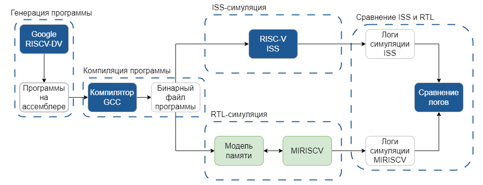
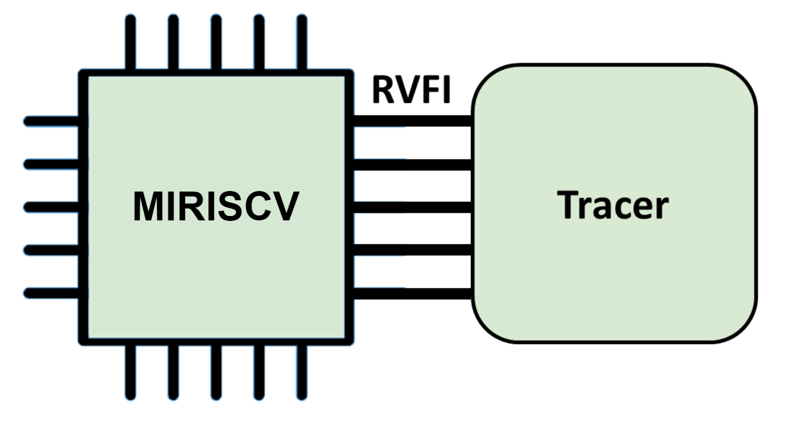

# Руководство пользователя по взаимодействию с окружением процессорного ядра MIRISCV

MIRISCV - это процессорное ядро, разработанное НИУ МИЭТ, которое поддерживает ISA RV32IM. 

<div align="center">


</div>

## Основные характеристики
- Поддержка стандартов ISA RV32I и RV32M
- Только machine privilege mode
- 4-х стадийный конвейер
- Настроенное окружение под проверку CoreMark
- Написан на SystemVerilog
- Подробная документация

## Взаимодействие с окружением ядра MIRISCV

### Какие задачи престоит выполнить?

> - Внести вклад в улучшение характеристик процессора с архитектурой RISC-V, повысив производительность предоставленного организаторами конвейерного процессора с архитектурой RV32IM.
>
> - Необходимо модифицировать микроархитектуру процессора путем увеличения количества стадий, добавлением предсказания переходов, исполнением нескольких инструкций одновременно, оптимизацией блоков ядра.

Для этого нужно выполнить 3 пункта:

1. Изменить исходники ядра в лучшую сторону, с точки зрения производительности
2. Проверифицировать разработанный дизайн
3. Получить метрики CoreMark для подведения итогов

Чтобы следовать этим пунктам нужно ознакомиться с файлами ядра, а также узнать, как можно верифицировать созданный вами дизайн.

Перед тем, как что-то изменять, давайте разберём общую схему тестирования, чтобы понять, как работает окружение.

### Общая схема тестирования

Итак, процесс тестирования представляет собой **последовательность**:

- Генератор инструкций генерирует программу
- Из инструкций собирается ассемблерный код
- Код компилируется при помощи RISC-V GNU Toolchain
- Тот же Toolchain генерирует бинарный файл
- Бинарный файл загружается в симулятор Spike
  - Запускается программная симуляция
  - Собирается ISS (Instruction Set Simulator) trace-log-файл процессора
- Бинарный файл загружается в модель памяти
  - Запускается RTL-симуляция процессора (используются UVM-компоненты для взаимодействия с интерфейсом памяти процессора)
  - Собирается RTL trace-log-файл процессора
- ISS и RTL trace-log-файлы конвертируются в CSV формат
- Сконвертированные файлы сравниваются и делается вывод о корректности работы процессора на RTL-симуляции

Схема тестирования представлена на рисунке ниже:

<div align="center">


</div>

<details>
<summary>Подробнее про компоненты окружения</summary>

- Генератор инструкций

В данном решении генератором инструкций является RISCV-DV Google. На рынке ПО существует решение, позиционирующее себя как открытая платформа для верификации RISC-V процессоров.

Генератор принимает необходимые настройки (они будут подробно рассмотрены позже) и генерирует ассемблерный файл.

- Компиляция программы

Далее ассемблерный файл подвергается компиляции. Это происходит за счёт набора инструментов RISC-V GNU Toolchain, в который входит riscv32-unknown-elf-gcc, который компилирует ассемблерный файл.

- ISS-симуляция

Бинарник, который мы получили загружается в симулятор Spike. Запускается программная симуляция и собирается ISS trace-log-файл процессора, который нам и нужен.

- RTL-симуляция

Бинарник, который мы получили, загружается в модель памяти верификационного окружения, к которой подключается ядро MIRISCV. 
Для сбора trace-log-файлов RTL-симуляции ядра, верификационное окружение и ядро реализуют и взаимодействуют через интерфейс RVFI. 

RVFI (RISC-V Formal Interface) – интерфейс формальной верификации RISC-V ядер.

Интерфейс состоит из статусных и информационных сигналов:
1. об адресации к внутренним регистрам/памяти
2. о выборке и индексировании инструкций
3. о текущем режиме работы процессора
4. о прерываниях/исключениях

Специальный модуль (tracer) может получать данные с выходных портов интерфейса и производить логирование.

<div align="center">



</div>


- Сравнение логов

Trace-log-файлы конвертируются в CSV формат, для более удобного сравнения с аппаратной точки зрения.


</details>

---

## Тестирование MIRISCV

### Концепция тестирования MIRISCV

|Все необходимое для запуска тестирования находится в директории miriscv_verification/core_miriscv/. <br> <br>Для запуска тестирования используется Makefile. <br> <br>Makefile подключает внутри себя Makefile от Ibex и переопределяет в нем переменные, цели, зависимости для верификации ядра MIRISCV.|
|-|

На самом деле подход очень простой и его можно разделить на две составляющие: 
- Изменить/создать файлы для RTL-симуляции MIRISCV
- Запустить RISCV-DV с нужными ключами

Следующие два заголовка более подробно описывают каждый из пунктов.

### Настройка  RISCV-DV и запуск Makefile

<details>
<summary>Памятка по работе с гитом в команде</summary> 
Первое, что вам нужно сделать при работе в команде - синхронизироваться. Для этого  не забывайте вводить в консоль в репозитории с проектом.

```
$ git pull
```

Считается, что участник владеет базовыми знаниями по работе с git.
</details>

Верификация написанного дизайна проводится в директории core_miriscv

```
$ cd miriscv_verification/core_miriscv/
```

Обязательно выполните загрузку модуля
```
$ module load mentor/QUESTA/10.7f
```

Здесь находится Makefile, благодаря которому мы будем запускать тесты.

Внутри Makefile есть таргеты, которые вызываются через консоль.

### Шаблоны запуска тестирования и аргументы Makefile
#### Общий шаблон для запуска тестирования:
- Определённый тест
```
$ make TEST=<Название теста> <Аргументы>
```

- Весь возможный набор тестов

```
$ make <Аргументы>
```

#### Остановимся на аргументах и разберём их поподробнее. 

|Название аргументов|Описание|Значение по умолчанию|Допустимые значения|
|-|-|-|-|
|TEST|Определяет тип теста из тестлиста|Если не указывается, то запускаются все тесты оттуда по очереди|[Список тестов](#testlist)|
|SEED|Число, определяющее рандомизацию инструкций генератором. 2 запуска тестов с одинаковым параметром TEST и одинаковым сидом будут иметь одинаковый асемблерный код|$RANDOM|1...32,767|
|WAVES|Отвечает за сохранение временных диаграмм|0|0/1|
|ITERATIONS|Количество итераций каждого теста|2|1...20|

#### testlist
|Название теста|Описание|
|-|-|
|riscv_arithmetic_basic_test|Арифметический тест. Без инструкций load/store и branch|
|riscv_rand_instr_test|10000 случайных инструкций RV32I|
|riscv_jump_stress_test|Стресс-тест на jump. Прыгаем туда-сюда по коду|
|riscv_loop_test|Тест на циклы (for, while)|
|riscv_rand_jump_test|Прыжки между подпрограммами с сохранением контекста|
|riscv_mmu_stress_test|Различные паттерны load/store, нагрузка для hazard unit|

#### Примеры:
- Запуск теста на случайные инструкции с сохранением временной диаграммы
```
$ make TEST=riscv_rand_instr_test WAVES=1
```

- Запуск теста с заданным сидом 10 раз
```
$ make TEST=riscv_rand_instr_test SEED=12345 ITERATIONS=10
```

- Запуск теста единожды
```
$ make TEST=riscv_loop_test ITERATIONS=1
```

---
## Изменить/создать файлы для RTL-симуляции MIRISCV

Исходники ядра MIRISCV находятся в папке rtl относительно корня репозитория

```
$ cd ~/miriscv_hackathon/miriscv/rtl
```

Подробнее про каждый блок ядра можно узнать [здесь](../miriscv/miriscv_scheme.md).

После изменения ядра, нужно будет верифицировать дизайн, по инструкции о запуске Makefile, написанным выше.

---

## Получение метрики CoreMark, для подведения итогов

Об этом подробно пишется в соответствующей документации, которая находится [здесь](../performance_analysis/performance_analysis.md).


## Информация о работе с логами

Информацию о работе с логами можно найти в [соответствующем руководстве](log_manual.md).
