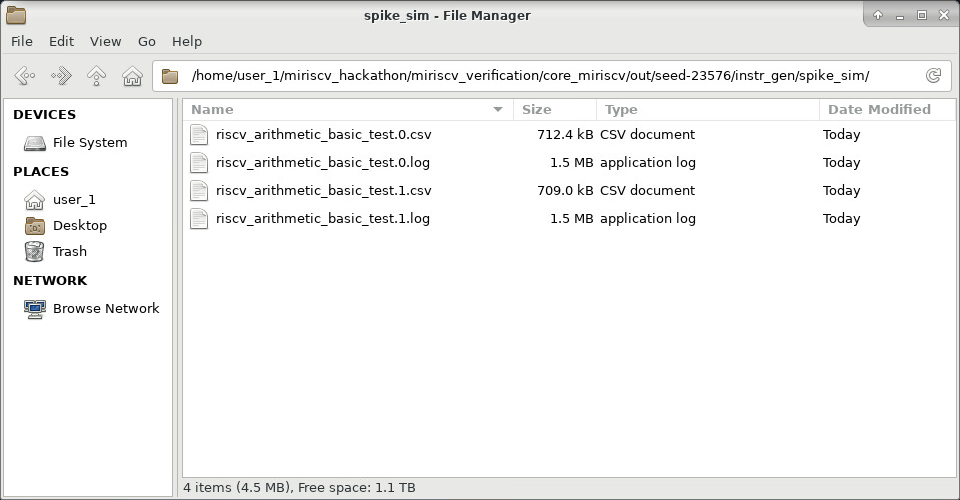
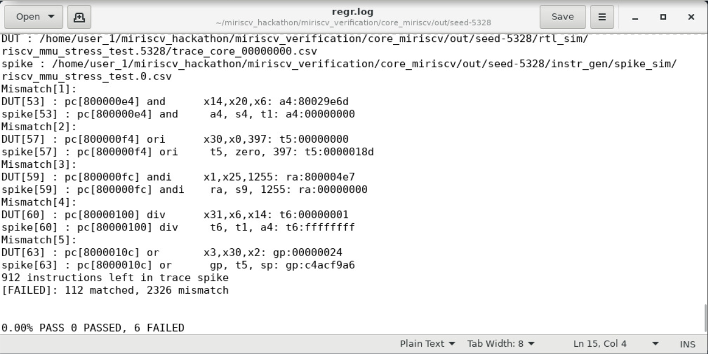

Для описания работы тестового окружения рассмотрим пример запуска тестирования с тестом `riscv_arithmetic_basic_test` и двумя итерациями данного теста. В момент запуска тестирования произвольным образом выбирается seed и после завершения тестирования в директории `out` появится директория `seed-<значение сида>`, которая примет следующий вид:


В этом примере seed принял значение 23576. Все файлы, относящиеся к запуску тестирования c seed-ом 23576, находятся в директории с именем `seed-23576`. В `instr_gen` есть директории `asm_test` и `spike_sim`. В `asm_test` содержатся исходные файлы программ на языке ассемблера, с помощью которых процессор тестируется, а в `spike_sim` - все файлы, относящиеся к RISC-V симулятору Spike. Папка `rtl_sim` содержит все файлы, относящиеся к симуляции тестируемого процессора.

При запуске тестирования сначала генерируются исходники на языке ассемблера RISC-V в директории `asm_test`. Это программы, с помощью которых будет проверяться процессор. Поскольку в нашем примере 2 итерации теста `riscv_arithmetic_basic_test` будет сгенерировано 2 исходника:
```
riscv_arithmetic_basic_test.0.S
riscv_arithmetic_basic_test.1.S
```
В реальности тестов и итераций будет куда больше, чем в нашем примере, но исходники всегда имеют следующий формат `<имя теста>.<номер итерации>.S`. Например, если бы тестирование было бы запущено с тестами `riscv_arithmetic_basic_test` и `riscv_rand_instr_test` с двумя итерациями, то в директории `asm_test` мы бы увидели следующие файлы:

```
riscv_arithmetic_basic_test.0.S
riscv_arithmetic_basic_test.1.S
riscv_rand_instr_test.0.S
riscv_rand_instr_test.1.S
```
После того как все исходные файлы сгенерированы для каждого из них создаются объектный и бинарный файлы. Например, для `riscv_arithmetic_basic_test.0.S` это `riscv_arithmetic_basic_test.0.o` и `riscv_arithmetic_basic_test.0.bin` соответственно. В результате исполнения этих действий `asm_test` примет следующий вид:


Бинарные и объектные файлы нужны для тестового окружения, вряд ли они могут принести много пользы для человека, проверяющего процессор.
Далее каждая программа из `asm_test` запускается на симуляторе Spike. Spike – это симулятор архитектуры системы команд RISC-V, воплощающий её функциональную модель. В тестовом окружении он используется в качестве эталонного процессора RISC-V. В результате запуска программы на симуляторе Spike создается лог файл, отражающий процесс исполнения Spike-ом данной ему программы. Например, после исполнения программы `riscv_arithmetic_basic_test.0.S` на Spike в директории `spike_sim` будет создан лог `riscv_arithmetic_basic_test.0.log`. Изучив этот лог, можно выяснить какие команды и в какой последовательности исполнил симулятор Spike для программы `riscv_arithmetic_basic_test.0.S`. В нашем примере 2 программы на ассемблере и поэтому по завершению этого этапа работы тестового окружения директория `spike_sim` примет следующий вид:


После того как все программы из `asm_test` были просимулированы на Spike (и, следовательно, для них были созданы логи Spike) для каждой программы из `asm_test` запускается RTL симуляция на тестируемом процессоре. Результаты этих симуляций будут направлены в соответствующие поддиректории `rtl_sim`.

В директории `rtl_sim` будет лежать `ITER` поддиректоррий, где `ITER` - это количество итераций. Эти поддиректории именуются следующим образом:
`<название теста>.<значение сида + i * ITER>, где i = 0, 1, 2 ..., ITER`

Например, если запущен тест `riscv_arithmetic_basic_test` с количеством итераций 2 и сидом 23576, будет сгенерировано два ассемблерных теста `riscv_arithmetic_basic_test.0.S` и `riscv_arithmetic_basic_test.1.S`. Для них в `rtl_sim` создаются поддиректории `riscv_arithmetic_basic_test.23576` и `riscv_arithmetic_basic_test.23578` соответственно. В этих поддиректориях будут созданы файлы `sim.log` и `trace_core_00000000.log`. Для директории `riscv_arithmetic_basic_test.23576` это будет выглядеть так:


Файл `sim.log` по существу является логом симуляции, который создаёт RTL симулятор (RTL симулятор — это программа для моделирования вашего Verilog кода, построения временных диаграмм). Этот лог отразит все проблемы, с которыми столкнется RTL симулятор при симуляции. Например, если процессор попытается считать данные из ячейки памяти, в которую никто никогда ничего не писал, то в `sim.log` можно увидеть сообщение об этом. В данном конкретном примере с попыткой чтения из неинициализированной ячейки памяти из анализа других логов будет очень трудно понять причину ошибки, поэтому `sim.log` важный файл для человека, проверяющего процессор. Файл `trace_core_00000000.log` отражает процесс исполнения тестируемым процессором данной ему программы. Этот файл создаётся на основе сигналов интерфейса `RVFI`, которые выставляет тестируемый процессор. Если в тестируемом процессоре интерфейс `RVFI` реализован правильно, то `trace_core_00000000.log` в поддиректории `riscv_arithmetic_basic_test.23576` позволяет понять какие команды и в какой последовательности исполнил тестируемый процессор при RTL симуляции с программой `riscv_arithmetic_basic_test.0.S`. При этом файл `sim.log `в поддиректории `riscv_arithmetic_basic_test.0` отражает процесс прохождения этой RTL симуляции с точки зрения RTL симулятора.

После того как для всех программ из `asm_test` завершена RTL симуляция на основе каждого лога Spike и каждого лога тестируемого процессора создаётся лог в формате `csv`. Например, из лога Spike `riscv_arithmetic_basic_test.0.log` находящегося в директории `spike_sim` и созданного для программы `riscv_arithmetic_basic_test.0.S` создаётся `riscv_arithmetic_basic_test.0.csv` в той же директории `spike_sim`. Также для лога тестируемого процессора `trace_core_00000000.log` находящегося в директории `riscv_arithmetic_basic_test.23576` и созданного для программы `riscv_arithmetic_basic_test.0.S` создаётся `trace_core_00000000.csv` в той же директории `riscv_arithmetic_basic_test.23576`. В результате директории `spike_sim` и `riscv_arithmetic_basic_test.23576` примут следующий вид:




Перевод этих логов из формата `log` в формат `csv` носит сугубо технический характер. Если сравнить внутренности лога процессора и лога Spike, то легко видеть, что они имеют различный стиль написания. Среда для тестирования приводит эти логи к единому стилю написания путём создания логов в формате `csv`.

Только после того, как все логи `csv` созданы, начинается проверка тестируемого процессора. В ходе этой проверки сравниваются соответствующие csv-файлы тестируемого процессора и симулятора Spike. Так, для проверки правильности исполнения процессором программы `riscv_arithmetic_basic_test.0.S` сравниваются файл `riscv_arithmetic_basic_test.0.csv` из `spike_sim` и файл `trace_core_00000000.csv` из `riscv_arithmetic_basic_test.23576`. После того как для всех программ будут соотнесены соответствующие csv-файлы будет создан файл `regr.log`, находящийся в корне директории `seed-23576`:


В нашем случае он выглядит так:


Здесь приведена краткая сводка по всем запущенным в рамках тестирования программам. Структура файла выглядит следующим образом:

```text
############################################
# Details of passing tests
############################################

<название теста1 (точнее название поддиректории в `rtl_sim` с результатами RTL-симуляции)>
---------------------------------
Test binary: <путь до объектного файла исполняемой программы>
UVM log: <путь до лога симулятора sim.log>
RTL trace: <путь до трейс-лога RTL симуляции>
ISS trace: <путь до трейс-лога Spike симуляци>
Comparison log: <путь до compare лога>

<Результат проверки. Если [PASSED], все ОК, в ином случае будет выведена информация об ошибках>

<название теста2>
---------------------------------
...


<% успешных тестов> <количество успешных тестов> <количество неуспешных тестов>
```

В самом низу `regr.log` сводка по всем программам. В нашем примере было 2 программы, обе выполнились без ошибок и поэтому в самом низу мы видим `2 PASSED, 0 FAILED`.

Рассмотрим ещё один пример. Предположим, что мы запустили тестирование, был выбран seed равный 5328 и мы получили следующий результат:


Глядя на содержимое директории `rtl_sim`, понимаем, что было 6 разных тестов (`riscv_arithmetic_basic_test`, `riscv_rand_instr_test` и так далее) по одной итерации каждый. Открываем `regr.log`, листаем в самый низ и видим следующее:



Вот незадача, все 6 программ из 6 завершились с ошибками. В самом верху `regr.log` видим следующее:


Видим, что при сравнении csv-файлов для программы `riscv_arithmetic_basic_test.0.S` тестовое окружение нашло несоответствия. Разберём более подробно первое несоответствие:


`dut` – это псевдоним вашего процессора в тестовом окружении. Соответственно в строке, начинающейся с `dut`, сказано, что 539-я по счёту инструкция в файле `csv` тестируемого процессора (считаем с нуля) имеет program counter равный `0x800008f0` и является инструкцией `or x3,x30,x2`, которая пишет в регистр `gp` значение `0x00063000`. Регистр `x3` имеет псевдоним `gp`, все псевдонимы регистров перечислены в таблице ниже:


В то же время в строке, начинающейся со `spike`, сказано, что 539-я по счёту инструкция в файле `csv` Spike-а имеет program counter равный `0x800008f0` и является инструкцией `or gp, t5, sp`, которая пишет в регистр `gp` значение `0x715ef11c`.

Учитывая это, понимаем, что ошибка в данном тесте заключается в том, что Spike пишет в `gp` одно значение, а тестируемый процессор – другое.

Найдём эту инструкцию в обоих csv-файлах. Открываем `riscv_arithmetic_basic_test.0.csv` (директория `spike_sim`) на строчке 541, если считать с единицы (учитывая то, что 539 – номер инструкции по порядку, начиная с нуля, а также то, что первая строка csv-файла не содержит инструкции, получаем, что искомая инструкция находится в 539+2=541 строке `csv`):


Поиск этой инструкции в `trace_core_00000000.csv` происходит немножко сложнее. Дело в том, что в процессе конвертации log-файлов в csv могут появляться расхождения. То есть номера строк для данной инструкции в файлах `riscv_arithmetic_basic_test.0.csv` и `trace_core_00000000.csv` не обязаны совпадать.

<details>
<summary>Узнать почему</summary>

Наиболее распространенные причины этого следующие:

- используются разные скрипты конвертации для Spike и RTL логов
- после завершения выполнения программы Spike и RTL симулятор в цикле выполняют некоторые последовательности инструкций. Количество итераций для Spike и RTL может отличаться
- в симуляторе Spike могут использоваться псевдоинструкции. Это инструкции, которые являются псевдонимами реальных иснтрукций. Одна псевдоинструкция может разворачиваться в несколько реальных инструкций.

Рассмотрим более подробно последний случай. Возьмем инструкцию `li`. В трейс-логе Spike симулции она записывается одной строкой:

```text
800000e4,,ra:00000000,,00000093,3,"li      ra, 0",,
800000ec,,t0:80000000,,0214e2b3,3,"rem     t0, s1, ra",, // следующая инструкция
```

Эта же инструкция в трейс-логе RTL симуляции выглядит следующим образом:

```text
800000e4,addi,ra:00000000,,00000093,,"addi  x1,x0,0","ra,zero,0",
800000e8,addi,,,00000013,,"addi x0,x0,0","zero,zero,0",
800000ec,rem,t0:80000000,,0214e2b3,,"rem  x5,x9,x1","t0,s1,ra", // следующая инструкция
```

Как мы можем видеть псевдоинструкция `li ra, 0` развернулась в 2 реальные инструкции: `addi ra,zero,0` и `addi zero,zero,0`.
</details>

Поэтому нужно применить творческий подход. Например, можно искать инструкцию по значение `pc`, при этом стоит всегда помнить о том, что одна и та же инструкция может быть исполнена несколько раз за тест (например, в случае цикла). Если в логе есть несколько инструкций с заданным `pc`, тогда нужно подумать и выбрать правильную из найденных. В этом деле, как правило, достаточно ориентироваться на интуицию и здравый смысл.

Итак, найдем эту инструкций в `trace_core_00000000.csv` (директория `rtl_sim/riscv_arithmetic_basic_test.5328`):


Первая строка csv-файла объясняет смысл указанных через запятую значений. Разберём некоторые из них:
- `pc` – адрес инструкции;
- `instr` – краткое обозначение инструкции;
- `gpr` – здесь указывается какой регистр из регистрового файла изменяет инструкция и какое значение этот регистр получает в ходе выполнения это инструкции;
- `сsr` – то же, что и для `gpr`, только для регистров контроля и статуса (`CSR`);
- `binary` – код инструкции;
- `mode` – текущий привилегированный режим;
- `instr_str` – строка с инструкцией на языке ассемблера.

В более удобочитаемом формате можно отыскать эту инструкцию в log-файлах. Искать в log-файлах по порядковому номеру мы не будем, поскольку log-файлы по количеству строк также не обязаны совпадать с соответствующими csv-файлами. Тут также нужно применить творческий подход.

Итак, открываем `trace_core_00000000.log` (директория `rtl_sim/riscv_arithmetic_basic_test.5328`) и с помощью `Crtl+F` ищем `0x800008f0`. В этом случае эта инструкция встречается 1 раз за весь тест, поэтому мучительного поиска удалось избежать:


Что значат эти столбцы написано в самой первой строке `trace_core_00000000.log`. Разберём значения этих столбцов:

- `Time` – момент времени, в который инструкция была получена тестовым окружением от процессора по интерфейсу `RVFI`;
- `Cycle` – номер такта, соответствующий моменту времени `Time`;
- `PC` – program counter полученной инструкцией;
- `Insn` – код инструкции (`PC` – адрес инструкции, `Insn` – значение, лежащее по этому адресу);
- `Decoded instruction` – строка с инструкцией на языке ассемблера;
- `Register and memory contents` – содержит значения регистрового файла и памяти, которые связаны с исполнением данной инструкции. Например, в показанном на скриншоте выше log-файле справа от `or x3,x30,x2` указано, что эта инструкция записывает в `x3` значение `0x00063000` и перед её исполнением `x30` равнялся `0x301e311c`, а `x2` равнялся `0x4146f000`.

Найдём теперь эту инструкцию в log-файле Spike. Открываем `riscv_arithmetic_basic_test.0.log` (директория `spike_sim`) и с помощью `Crtl+F` ищем `0x800008f0`:


Синим на скриншоте выделено все то, что относится к одной инструкции, имеющей искомый адрес `0x800008f0`. Сначала, как видим, идёт адрес, затем код инструкции и представление инструкции на языке ассемблера. На следующей строке снова указан адрес инструкции, снова код инструкции, затем номер регистра, который изменяет данная инструкция, и, наконец, значение, которое инструкция присваивает данному регистру.

Пожалуй, больше ничего ценного из логов вытащить не удастся.

Теперь мы знаем, какую информацию мы можем добыть из логов. Давайте же теперь, вооружившись этим знанием, попробуем найти причину ошибки.

Выше мы уже выяснили, что ошибка в данном тесте заключается в том, что Spike пишет в `sp` одно значение, а тестируемый процессор – другое. В качестве напоминания привожу скриншот, который уже имеется выше по тексту.


Инструкция одна и та же `or x3,x30,x2`, но вот вычисленное этой инструкцией значение отличается. Какие у этого могли быть причины? Быть может значение `t5 (x30)` и/или `sp (x2)`, используемое для операции логического «ИЛИ», в Spike одно, а в тестируемом процессоре — другое. Если значения этих регистров одно и то же, а результат вычислений отличается, то значит либо Spike вычисляет результат логического «ИЛИ» неправильно, либо тестируемый процессор. Что же, вычислим результат вручную и разберемся кто из них не прав. Напомню значения регистров: `x30=0x301e311c`, `x2=0x4146f000`. Вычислим с помощью того же калькулятора результат логического «И», получим:


Итого, правильный результат `0x715ef11c`. Именно это значение и получил Spike. Получается, тестируемый процессор неправильно вычисляет логическое «ИЛИ».
Откроем временную диаграмму, чтобы выяснить, что именно происходит в процессоре. В директории `rtl_sim/riscv_arithmetic_basic_test.5328` должен находиться файл с временной диаграммой `waves.wlf`. Для того, чтобы его открыть, воспользуемся инструментом Questa Sim. Для его запуска нужно ввести следующую команду:

```bash
$ vsim -view waves.wlf
```

Увидим следующее:


Главное окно можно разбить на следующие части:

1. Меню
2. Панель инструментов
3. Окно с иерархической структурой модулей
4. Objects - окно со списком сигналов для выбранного модуля (и входные/выходные, и внутренние)

<details>
<summary>Поиск сигналов и модулей</summary>

В окне с сигналами и с иерархической структурой модулей можно производить поиск. Для этого нужно сделать окно активным и нажать `Ctrl+F` (либо ПКМ -> Find). В результате появится окошко для поиска. Есть два основных режима поиска: `Contains` и `Find`. 

В режиме `Contains` в окне остаются только модули, удовлетворяющие условию поиска. При этом поиск производится только среди модулей, которые раскрыты. Вот как это выглядит:


В режиме `Find` в окне остаются все модули, а совпадения показываются в отдельной всплывающей окошке. При этом поиск производится среди всех модулей, а не только раскрытых. Вот как это выглядит:


Поиск в окне со списком сигналов `Objects` производится аналогичным образом.
</details>

Как мы можем видеть, окно с иерархической структурой модулей содержит модуль тестбенча `miriscv_tb_top`, в котором находится топовый модуль тестируемого процессора `u_miriscv_core`

Его сигналы и сигналы, входящих в его состав модулей, нам крайне интересны. Отобразим их на временной диаграмме. Для этого кликаем на `u_miriscv_core` в окне с иерархической структурой модулей, рядом в окне Objects отобразятся все сигналы данного модуля. Выберем любой из них и кликнем `Ctrl+A`, выделив тем самым все сигналы данного модуля. Затем кликаем правой кнопкой мыши и выбираем `Add Wave`. Это откроет окно с временной диаграммой, на котором отобразятся все выбранные сигналы.


Получится примерно следующее:


Аналогичным образом добавим сигналы всех модулей, входящих в состав тестируемого процессора.

Из `trace_core_00000000.log` (`rtl_sim/riscv_arithmetic_basic_test.5328`) видно, что наша проблемная инструкция `or x3,x30,x2` была получена тестовым окружением от процессора по интерфейсу RVFI в момент времени `78710000 ps`. Чтобы быстро найти этот момент времени на временной диаграмме, необходимо нажать ПКМ на нижней части временной диаграммы и выбрать `Cursor Properties`.


В появившемся окошке нужно указать требуемое время и нажать `OK`. Курсор переместится в нужный момент времени. Чтобы перейти к курсору и приблизить временную диаграмму нужно нажать на `Zoom In on Active Cursor` на панели инструментов.

> Для масштабирования диаграммы также можно использовать сочетние `Ctrl + колесико`. Также можно выделить область масштабирования зажатым колесиком мыши.


В результате мы получим следующее:


Смотрим и убеждаемся, что действительно в момент времени `78710000 ps` по интерфейсу RVFI тестовому окружению процессором была передана инструкция с адресом `0x800008f0` и кодом `0x002f61b3`, как и было заявлено в log и csv-файлах выше.

При этом видно, что сигнал `rvfi_rd_wdata_o` принимает значение `0x00063000`. Именно это значение было процессором неправильно вычислено, что мы и выяснили выше. Лезем в `miriscv_rvfi_controller` и смотрим откуда идёт данный сигнал:


Из скриншота выше видно, что данный сигнал обновляется по восходящему фронту тактового импульса. Это означает, что момент вычисления данного сигнала на такт левее на временной диаграмме, чем момент передачи проблемной инструкции по RVFI. Также понимаем, что нас интересует входной сигнал контроллера RVFI `w_wb_data_i`. Открывая `miriscv_core`, видим следующее:


После таких недолгих поисков узнаем, что значение сигнала `rvfi_wb_data[m]` формируется на мультиплексоре с управляющим сигналом `e_gpr_src_sel_i` и идёт на регистровый файл.


Найдем сигналы `e_gpr_src_sel_i`, `m_gpr_wr_en_o` и `m_gpr_wr_data_o` на временной диаграмме:


Из временной диаграммы видим, что `m_gpr_wr_en_o = 1`, `m_gpr_wr_data_o = 0x00063000` (наше неправильное значение) и `e_gpr_src_sel_i = 0`. Открываем файл с параметрами и видим:


Ага. Значит `e_gpr_src_sel_i` равен `ALU_DATA`. Тогда получается, что `m_gpr_wr_data_o = e_alu_result_i`. Значит неправильный результат поступает с сигнала `e_alu_result_i`. Снова обращаемся к коду `miriscv_core`, чтобы выяснить кто управляет сигналом `e_alu_result_i`:


Из скриншота выше видим, что данный сигнал идет с АЛУ (неудивительно, но факт). Теперь нас интересует сигнал `alu_result_o` модуля `miriscv_alu`. Ниже приведена логика формирования данного сигнала:


Уже и так видно, что логика описана с ошибкой: перепутаны местами операции логическое «И» и «ИЛИ». Исправим ошибку и запустим тестирование с тем же значением seed:


Вновь получим директорию `seed-5328`:


Открываем regr.log и листаем в самый низ:


Все ошибки исчезли.